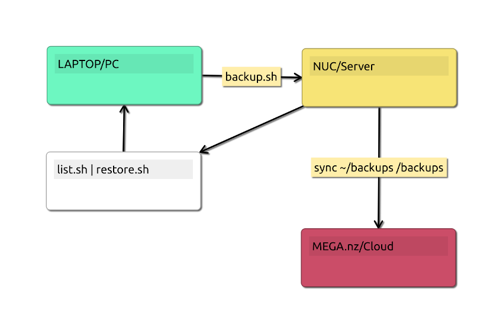

# Backup List Restore via SSHFS

Backup List Restore via an Secure Shell Files System Mount.
The backup is directly over ssh created, is encoded and compressed on the remote system or server.
It is a modifiable, selective backup system, where known application and none required meta data is skipped.
Thus saving you space and backup and restore time, by at least %30.


## Utilities here provided

Scripts: backup.sh, list.sh, restore.sh, enarch.pl
In .bashrc ->
              alias backup="~/dev/B_L_R_via_sshfs/backup.sh"
              alias backup_list="~/dev/B_L_R_via_sshfs/list.sh"
              alias backup_restore="~/dev/B_L_R_via_sshfs/restore.sh"
              alias enarch="~/dev/B_L_R_via_sshfs/enarch.pl"

Notice, that on Linux systems you don't need to install Perl language or any modules to run enarch.pl.
A normal typical backup of files with this system, of around 2 G, can take over 10 minutes.
However searching and selecting for restore is lighting fast, as an separate compressed index is used.
You are better of using this backup system then zip or any other archiving tools, for this but also
for compression reasons. As this is being tuned on for an typical coders home directory and contents.

Supplied, *enarch* is an all in one utility.
Standalone and more CLI geared for attachments and smaller archives.
You are required to generate a in special format passphrase with enarch.
So it is uniform, not to short or not to long or complex to remember.
That's in its design, take it or leave it. :)

The rule of thumb for securing here is, don't store any trace or piece of your passphrase on the target computer,
the one you are backing up on. And even if you provided an passphrase that always will remember, well, are you
willing on some rare occasion give it to someone, to restore your PC at work, over the phone, from backup?

Hence, with this system, you are forced, to use a proper password.
How will you remember it?
 Well, that is your problem. (not really :)).

```bash
enarch -?
```

For better easier control and better maintenance use *backup.sh* and rest of shell scripts.
Since they all share the *backup.config* file, in one place, all settings for your computer.

## Installation

You are required sudo access, and have the following linux packages installed:

```bash
sudo apt install ssh -y
sudo apt install sshfs -y
sudo apt install gpg -y
sudo apt install pv -y
```

Install also [FZF](https://github.com/junegunn/fzf), to use the awesome **list.sh** script.

### To install this project

```bash
git clone https://github.com/wbudic/B_L_R_via_sshf
```

## Configuration

Create a mount point, ever once before running any other scripts.

```sh
sudo mkdir /mnt/{REMOTE_SERVER_ALIAS_OR_IP}
sudo chown {user} /mnt/{REMOTE_SERVER_ALIAS_OR_IP}
```

It is recommended to use an alias in the script. Which is set by modifying your **/etc/hosts** file. And by assigning the remote destination IP address to an alias.

* Update **backup.config** to this remote server alias, to read:

  ```sh
  DEST_SERVER={REMOTE_SERVER_ALIAS_OR_IP}
  ```

* Make also further changes in the config file as necessary, depending on your system.
* Update and change directories in the **backup.sh** script, to suit your home directory.
* Update and configure **backup.config** to suit your system.
  * By default only the home directory is backed up, or paths has access to.

  ```sh
    sudo mkdir /mnt/nuc; sudo chown user /mnt/nuc
  ```

  * To include or exclude further directories, extensions
    * WILDFILES variable  is the includes found files by file extension or wild card set paths.
  * Change and keep somewhere safe the GPG_PASS
    * This can be password can be created using:
    
    ```sh 
    ./enarch.pl -gpggenerate
    ```

### Auto Mounting SSH for SSHFS

Following are steps required to enable automatic user trust with an remote server and your local machine being backed up.
This is required step if running the backup as a scheduled cron job.

* Make and obtain an local public key. sftp it to {user}@{remote or IP}/.ssh
  * cd ~/.ssh; ssh-keygen -t rsa.
  * sftp {user}@{remote or IP}/.ssh; put id_rsa.pub
* ssh into remote, ssh {user}@{remote or IP}/.ssh, and add to trusted hosts.
  * cat id_rsa.pub >> authorized_keys
  * chmod 600 authorized_keys

### Setting up MEGA Cloud (Optional)

Cloud clients are mounted to connect to the server on the internet. See MEGA.nz for further instructions, and for free account.
The data is OpenSSL encrypted and stored there, so don't loose the password and key for over there.

How it work you start on your server, a mega client connection to the cloud, and issue an mounted synch to the ~/backups directory.
Each type backup is run and has completed to the server it will slowly sync and mirror the directory on the cloud.


```sh
$ mega-cmd
login your@email.com xxxxxxxxxxxxxxxxxxxxxxxxx
your@email.com:/$ sync /home/will/backups /backups 
your@email.com:/$ tree
 backups
    ├── last_bck_before_mint_20_install
    │   ├── nomad-20211002.lst.xz
    │   └── nomad-20211002.tar.xz.enc
    ├── releases
    │   ├── LifeLog-master-1-6.zip
    │   └── thttpd_dev_1_8.tar.7z
    ├── metabox-20180517.7z
    ├── metabox-20190806.dev.tar.gz
    ├── metabox-.tar.gz
    ├── nomad-20210618.lst
    ├── nomad-20211127.tar.xz.enc
    ├── nomad-20211128.lst.xz
    ├── nomad-20211128.tar.xz.enc
    ├── nomad-20211129.tar.xz.enc
    └── test.txt
```

* **IMPORTANT NOTICE** **!!!** MEGAcmd can be initially used but should be avoided for scripting.
  * ``` /backups ``` directory must exist as an REMOTEPATH in your account on the MEGA cloud, easy to create with after mega-login with ```mega-mkdir backups```.
  * DO NOT mega-sync ~/home/{user}/backups /backups from multiple locations or different computers, including your home!  
    * Guess what will (can) happen during a long backup?
    * Target or the physical DEST_SERVER, should only be issued with an: ``` mega-sync ~/home/{user}/backups /backups ```    

## Running

The **backup.sh** can be called from any directory. Usually an alias can be used to start the backup.

To restore home root directory is required or an temporary one, with or without an list of files to extract.
Files then can be observed or moved once restored, to desired location.
Examples:

```bash
you@your_pc:$ mkdir ~/temp/backup; cd ~/temp/backup
you@your_pc:~/temp/backup$ ~/restore.sh restore.lst
```

To create a selective restore list of one or many files. Run ./**list.sh** in the directory you want to restore to. You can select multiple files by highlighting the file in a line and pressing the **tab** key.

```bash
you@your_pc:~/temp/backup$ ~/list.sh
```

or

```bash
you@your_pc:~/temp/backup$ ~/list.sh -?
```

to see help on further options.

## Vim Integration

To capture and observe the backup in vim. It is recomended to use the AsyncRun plugin.

Activate the backup in vim with command:

```BASH
:AsyncRun -mode=term -pos=tab ./backup.sh
```
This can take a long time, you can create a new window while it is busy, and/or to navigate to previous tab.
**<ctrl>ws** **gt**

Notice - Large backup list are in raw text format in a terminal, they will not hog your computer or require as much memory as an word document.

